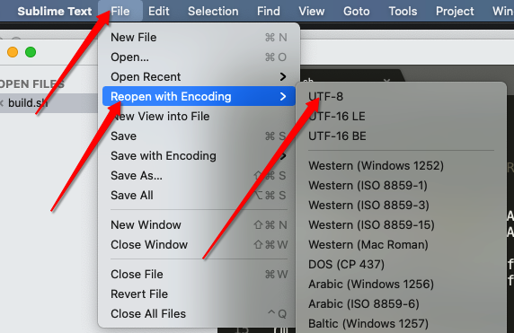
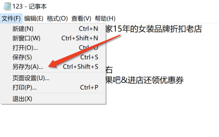
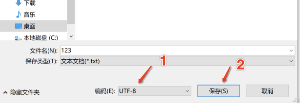
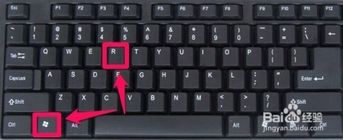
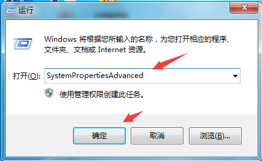
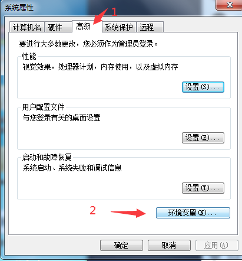
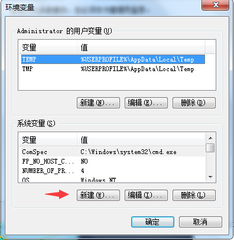
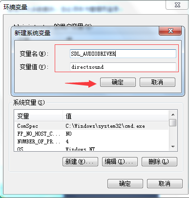
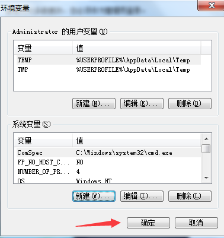
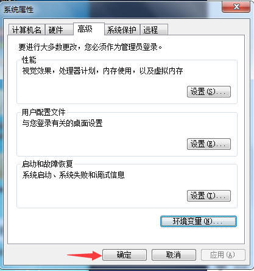

# 关于卡的退换说明

> 1. 没激活随时退款
> 2. 若有使用问题一周内全额退款
> 3. 两周内可补差价升级卡或换卡(升换只能一次)
> 4. 日卡不支持升级或换卡

# 容易出错的点

> 1. 配音文案问题，文案编码必须utf-8
> 2. 配音员问题，中文不能用仅英文配音员，英文不能用仅中文配音员，如果不确定就用中英文

----

# 文件乱码问题及其他关于文案的问题

**重要说明**

1. 文案的编辑推荐使用sublime[sublime编辑器](https://sublimetextcn.com/)，sublime 修改编码方法修改完保存文件

2. 如果不用sublime，遇到编码问题用记事本修改编码

> 1. 点击文件，另存为

> 2. 选择UTF-8编码，保存

----

# 卡号无法激活

> 请先检查复制的卡密是否包含空格等字符，确认无法激活使用的，请联系客服处理

----

# 视频处理失败

比如出现以下问题：1. 合并失败 2. 添加片头失败 3.视频截取不生效，等等，或者其他异常的情况(目前为止遇到过的情况是用户自己录制的视频无法截取,)

解决方法：将视频进行强制转换成mp4,不管原视频是否为mp4,都进行强制转换，转换后的视频再进行剪辑就能正常。

----

# 软件升级

删除旧版所有文件，解压新版压缩包

----

# 合并与配音

合并与配音需要在子目录下进行。
比如新建一个文件夹1，然后在1内建立文件夹2，然后把把素材放到2里面，最后通过媒体目录的形式选择文件夹1就可以操作了

----

# 关于处理速度

处理速度跟视频的大小，分辨率，时长，以及操作有关等相关，不同的操作耗时不一样，电脑性能不同处理速度也不同，可能一秒钟，也可能一个小时。(主要影响因素为，操作类型，操作数量，视频大小，电脑配置)
核心因素：
1. 视频过大
2. 勾选操作过多
3. 电脑配置低
4. 参数配置不合理

怎么提速
> 1. 使用GPU加速(部分显卡会导致画质变差)，不建议使用
> 2. 配置栏选择速度和画质（选快，最快等），不建议修改
> 3. 换台高配电脑
> 4. 去掉不必要的操作
> 5. 配置合理的参数
> 6. 关闭电脑上不用的软件
----

# 关于GPU加速

支持Intel，AMD，Nvidia 3类显卡（如果是Nvidia 显卡，需要 GTX10 和 RTX20 以上的才支持），如果显示不支持，那么请更新显卡对应的最新版驱动软件，如果使用独立显卡，请先设置默认显卡为独立显卡。

**开了GPU后画质变模糊** 这里有两种情况，

>  一是GPU配置太低，这种情况就不建议开加速
>  而是GPU驱动问题，更新驱动即可解决
> mac系统，windows Intel 显卡 以及 windows AMD 显卡  直接就能用，不需要驱动

[Nvidia显卡驱动下载](https://developer.nvidia.com/zh-cn/cuda-downloads)

----

# 处理后的视频无法打开

视频本身没有问题，换个播放器就可以了

----

# win7 预览和试听问题

如果发现配音栏无法试听，或者视频预览没有声音，则需要进行一下配置

1. 键盘输入 win + r 键

2.然后在弹出的输入框内输入 `SystemPropertiesAdvanced` 点击确定 

 

3. 选择 高级 -> 环境变量 

4. 点击下面的新建 

5. 在弹出的输入框内 填入 `SDL_AUDIODRIVER` 和 `directsound` 然后点击确定

6. 点确定

7. 最后再点确定

8. 重启电脑，打开软件即可试听

