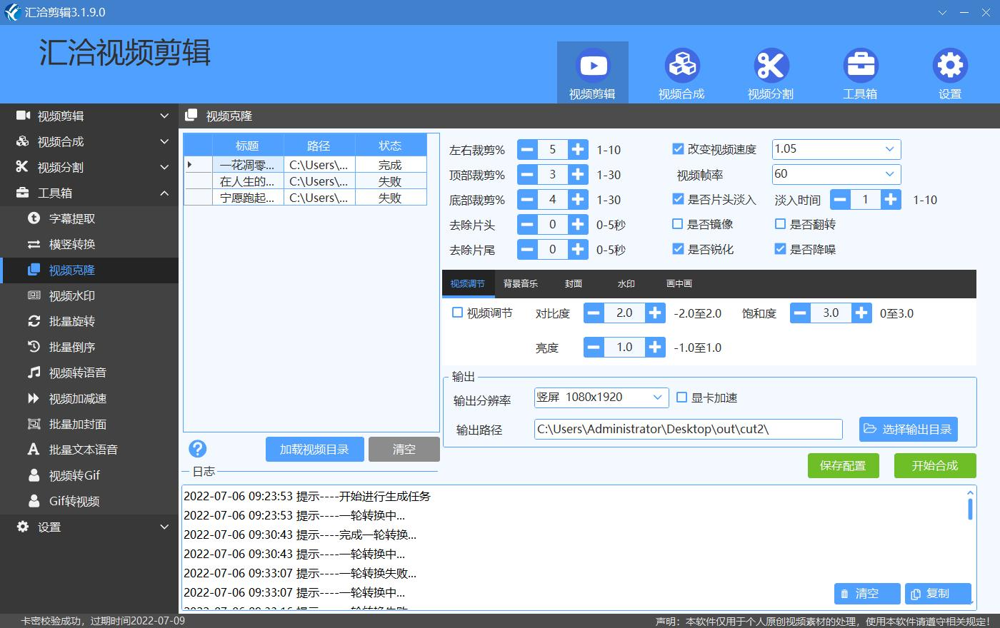

一般竖版视频或者是横版转竖版的情况，都需要分辨率，加工样式，顶部文字，底部文字 3个功能组合使用，所以这里我重点讲解一下，后面项目教程中就直接操作演示。

!> 视频的加工，需要对视频的基本属性有一些了解，

## 1. 视频分辨率

  1. 按视频的长宽，一般定义为横屏或竖屏;
  2. 按主流app的视频效果，横屏常见尺寸： 1280x720，1920x1080，竖屏常见尺寸：720x1280，1080x1920

## 2. 视频加工

  1. 对视频进行边距裁剪、去片头/片尾、修改视频速度、帧率、画质调整
  2. 视频倒序
  3. 加水印
  4. 视频-Gif互转
  5. 横竖屏转换
  6. 更多加工功能，请查看软件工具箱
  

## 3. 顶部文字，底部文字

  1. 批量操作时，支持给每个视频添加不同的文字
  2. 顶部 和 底部都支持多行文字

## 4. 组合使用